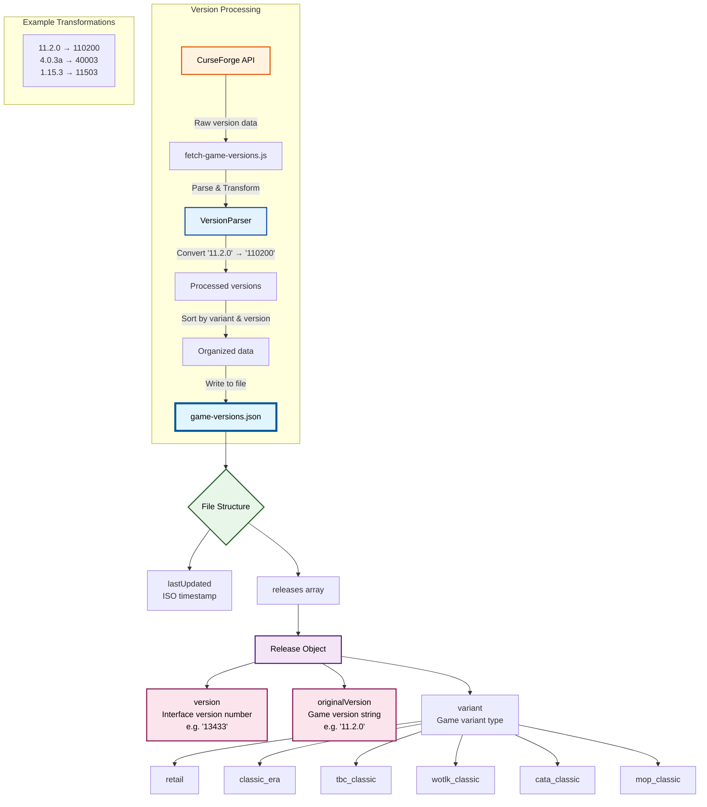

# Development Guide

This document provides technical details about the WoW Renovate Datasource project architecture and development workflow.

## Architecture Overview

### Data Flow



## Project Structure

```
wow-renovate-data/
├── src/
│   ├── curseforge-client.js    # CurseForge API client
│   ├── version-parser.js       # Version parsing logic
│   ├── fetch-versions.js       # Main addon versions fetcher
│   ├── fetch-game-versions.js  # Game versions fetcher
│   └── __tests__/              # Jest test files
├── game-versions.json          # Generated game versions data
├── versions.json               # Generated addon versions data
├── .github/workflows/          # GitHub Actions CI/CD
├── .vscode/                    # VS Code configurations
└── eslint.config.js            # ESLint configuration
```

## Key Components

### VersionParser

The `VersionParser` class handles conversion between different version formats:

- **Input**: CurseForge version strings (e.g., "11.2.0", "4.0.3a")
- **Output**: WoW interface version numbers (e.g., "110200", "40003")

Key features:

- Supports versions with optional single letter suffix (e.g., "4.0.3a")
- Validates version format (must be X.Y.Z or X.Y.Z[letter])
- Converts to padded numeric format for sorting

### CurseForgeClient

Handles all API interactions with CurseForge:

- Authentication via API key
- Rate limiting and error handling
- Fetches addon and game version data

### Data Files

#### game-versions.json

Contains all WoW game versions organized by variant:

```json
{
  "lastUpdated": "2025-07-20T09:34:24.254Z",
  "releases": [
    {
      "version": "13433",  // This specific number is required when uploading addon versions to CurseForge
      "originalVersion": "11.2.0",
      "variant": "retail"
    }
  ]
}
```

#### versions.json

Contains all WoW game versions with full metadata:

```json
{
  "lastUpdated": "2025-07-19T16:26:34.657Z",
  "versions": [
    {
      "version": "11400",
      "name": "1.14.0",
      "variant": "classic_era",
      "gameVersionTypeId": 67408,
      "versionTypeName": "WoW Classic Era",
      "versionTypeSlug": "wow-classic-era"
    }
  ]
}
```

Note: This file contains more detailed version information than `game-versions.json`, including CurseForge-specific metadata like `gameVersionTypeId` and slug information.

## Development Workflow

### Prerequisites

- Node.js 22.x
- npm
- CurseForge API key (set in `.env` file)

### Setup

1. Clone the repository
2. Install dependencies: `npm install`
3. Create `.env` file with your CurseForge API key:
   ```
   CURSEFORGE_API_KEY=your-api-key-here
   ```

### Running Scripts

```bash
# Fetch latest game versions
npm run fetch-game-versions

# Fetch addon versions
npm run fetch-versions

# Run tests
npm test

# Run linting
npm run lint

# Fix linting issues
npm run lint -- --fix
```

### VS Code Launch Configurations

The project includes several VS Code launch configurations:

- **Run Fetch Script**: Runs the addon versions fetcher
- **Run Fetch Game Versions Script**: Runs the game versions fetcher
- **Jest All Tests**: Runs all tests
- **Jest Current File**: Runs tests for the current file
- **ESLint All Files**: Lints all source files
- **ESLint Current File**: Lints the current file
- **ESLint Fix All Files**: Auto-fixes linting issues

### Testing

The project uses Jest for testing. Test files are located in `src/__tests__/`.

Run tests with:

```bash
npm test
```

### CI/CD

GitHub Actions workflows run on every push:
- **Lint workflow**: Runs ESLint on all source files
- **Test workflow**: Runs all Jest tests

Both workflows use Node.js 22.x.

## Version Format Details

### Interface Version Calculation

The interface version is calculated as:

```
major * 10000 + minor * 100 + patch
```

Examples:
- 11.2.0 → 11 * 10000 + 2 * 100 + 0 = 110200
- 1.15.3 → 1 * 10000 + 15 * 100 + 3 = 11503
- 4.0.3a → 4 * 10000 + 0 * 100 + 3 = 40003 (letter suffix ignored)

### Game Variants

- **retail**: Current retail version of WoW
- **classic_era**: Vanilla Classic (1.x versions)
- **tbc_classic**: The Burning Crusade Classic (2.x versions)
- **wotlk_classic**: Wrath of the Lich King Classic (3.x versions)
- **cata_classic**: Cataclysm Classic (4.x versions)
- **mop_classic**: Mists of Pandaria Classic (5.x versions)

## Contributing

1. Create a feature branch
2. Make your changes
3. Ensure all tests pass: `npm test`
4. Ensure linting passes: `npm run lint`
5. Submit a pull request

## Troubleshooting

### Common Issues

1. **Mixed line endings**: Run `npm run lint -- --fix` to normalize line endings
2. **API rate limits**: The CurseForge client includes built-in rate limiting
3. **Invalid version formats**: Check that versions match X.Y.Z or X.Y.Z[letter] format

### Debug Mode

Set `DEBUG=*` environment variable to see detailed logs:
```bash
DEBUG=* npm run fetch-versions
```
